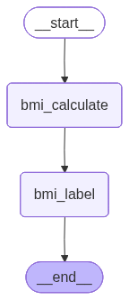
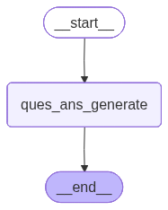
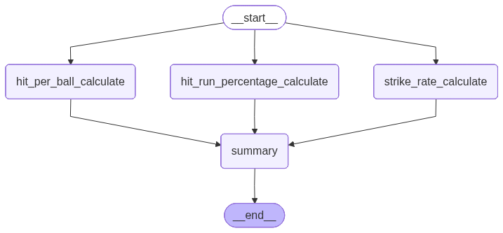
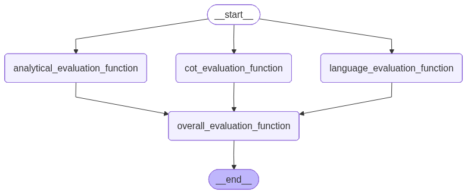
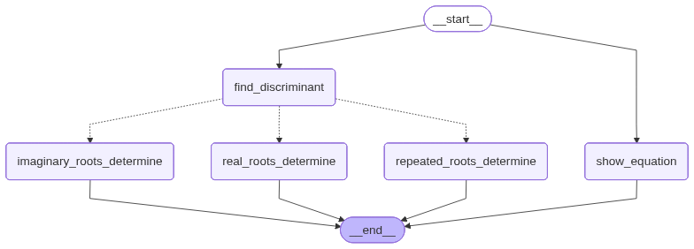
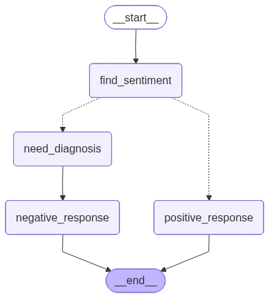

# LangGraph

1. # Workflow Sequence
   1. ## Sequential workflow
      1. ### Without LLM BMI calculate (Hardcoded) [==>](1_Workflow_Sequence/1_Sequencial_Workflow/1_Without_LLM_BMI.ipynb) 
      2. ### Using LLM Question Answering [==>](1_Workflow_Sequence/1_Sequencial_Workflow/2_Using_LLM_Question_Answer.ipynb) 
   2. ## Parallel workflow 
      1. ### Without LLM Cricket calculate (Hardcoded) [==>](1_Workflow_Sequence/2_Parallel_Workflow/1_Without_LLM_Cricket.ipynb) 
      2. ### Using LLM Essay Evaluation [==>](1_Workflow_Sequence/2_Parallel_Workflow/2_Usign_LLM_Essay_Evaluation.ipynb) 
   3. ## Conditional workflow 
      1. ### Without LLM Quadratic Equation (Hardcoded) [==>](1_Workflow_Sequence/3_Conditional_Wrokflow/1_Without_LLM_Qudratic_Equation.ipynb) 
      2. ### Using LLM Review Reply [==>](1_Workflow_Sequence/3_Conditional_Wrokflow/2_Usig_LLM_Review_Reply.ipynb) 
   4. ## Iterative workflow 
2. Chatbot